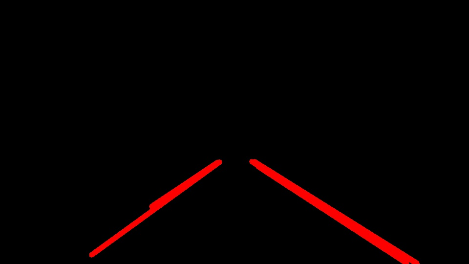

# Udacity Self-Driving Car Engineer Nano Degree Project-1                                              (Finding Lane Lines on the Road)
                           

Overview 
---

When we drive, we use our eyes to decide where to go.  The lines on the road that show us where the lanes are act as our constant reference for where to steer the vehicle.  Naturally, one of the first things we would like to do in developing a self-driving car is to automatically detect lane lines using an algorithm.

In this project you will detect lane lines in images using Python and OpenCV.  OpenCV means "Open-Source Computer Vision", which is a package that has many useful tools for analyzing images.  

 I will use the tools about computer version to identify lane lines on the road. I will develop a pipeline on a series of individual images, and later apply the result to a video stream (really just a series of images).
 
Pipeline of Project 
---

1- Converted the images to grayscale from RGB model
  
  a) Orginal Image  
    
     
  b) Orginal Image with Grayscale model  
    
     
  
2- Apply Gaussian smoothing to the grayscaled image  
      
     
3- Use canny edge detection to find all edges  
    
      
4- Apply hough transformation to find the lines in the region of interest  

     
    
Draw the lines over the original image. More than one lines are generated from the previous step for left/right lane. We use the slope to detect if a specific line belongs to the left/right lane. Then we fit a liear polynomial among all the points and use that line as the left/right lane. It helps to reduce the number of lines in the image.

5- Finally, we add the lane lines image and innitial image together.

Apply Hough Line detection on the mask and collect identified line segments for the next additonal step. In the example below, I validate the good performance on both line types despite shadow conditions. Next we will make up for full solid lines.

The line extraction pipeline proved very efficient using movies even with challenging shading conditions.

For a video clip, we apply the above procedure to each frame.

Test on videos
---
We can test our solution on three provided videos:

solidWhiteRight.mp4

solidYellowLeft.mp4

challenge.mp4

You can find the result of the videos in the folder "test_videos output"

Conclusion
---

The project was successful as all lines were also successfully recognized on the challenging video.
A disadvantage of this solution is that only straight lane lines are recognized. By using, for example, poly fitting, the algorithm could be modified so that it also recognizes curved lines. For the videos provided, this is not a problem as the lines closest to the car are straight.
Another problem shows us that the horizontal line is explicitly set as the upper limit of the lane lines and only works well if the road is not too steep. In this case the upper horizontal line would have to be estimated differently.
